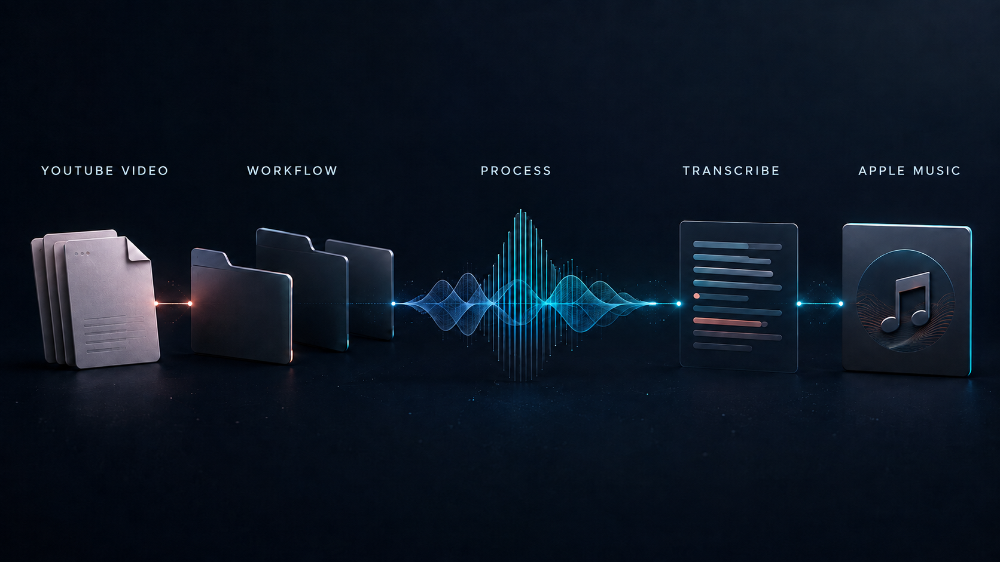

# music-inbox



A macOS folder-based media workflow: queue an online video URL to download and tag its audio with yt-dlp, import it into Apple Music, or produce local transcripts and English translations with Whisper.

The initial setup creates this folder hierarchy from one chosen root:

```text
1 Drafts/
2 Queued/
3 Processing/
4 Done/
5 Failed/
```

That root may be synced—for example, an Obsidian vault in iCloud—because it contains the small, user-facing request notes and completed results. Music Inbox separately stores all machine-only data in a local folder.

## Setup

```bash
git clone https://github.com/bfalls/music-inbox.git
cd music-inbox
./install.sh
./bin/music-inbox doctor
```

The installer asks for the inbox root, a **local-only** data folder, browser-cookie preference, whether to remove the temporary MP3 after a confirmed Music import, and whether to enable optional local transcription. It stores the answers in `~/.config/music-inbox/config.env` with owner-only permissions and keeps its installed program files in `~/Library/Application Support/music-inbox`.

The installer places the `music-inbox` command in `/usr/local/bin` and registers that standard macOS command location in `/etc/paths.d`. Immediately before requesting an administrator password, it explains that permission is used only for those two shared system locations; the worker, notes, media, and models continue to run as your user. No shell-profile edits, reboot, or manual PATH setup are needed for a normal macOS Terminal shell. At the end of normal setup, it also asks whether to install the optional user-level background service.

The default local-only folder is `~/Library/Application Support/music-inbox`. Do not place it in iCloud Drive, Dropbox, OneDrive, an Obsidian vault, or another sync service. It holds downloaded media, partial downloads, language models, logs, locks, and duplicate-processing state. The installer warns when the chosen path looks synced.

Setup creates `1 Drafts/Default Music Request.md`. On an upgrade, an unchanged template updates automatically. A customized or unknown template is preserved and the new shipped version is added as `Default Music Request v<N>.md`. Duplicate the template you prefer, replace its example URL, uncomment the optional fields you want, and move the duplicate to `2 Queued`.

During setup, choose the request-template style that matches where you edit notes:

- **Obsidian** uses `%% … %%` comments, so Obsidian’s comment-toggle hotkey can activate an individual option line.
- **Standard** uses portable HTML comments (`<!-- … -->`) for regular Markdown editors and folders.

Both styles produce the same request fields once an option is uncommented.

## Dependencies

The worker requires `yt-dlp`, `ffmpeg`, `ffprobe`, and a JavaScript runtime such as Deno for YouTube challenge handling. By default it lets yt-dlp obtain its EJS challenge component from GitHub; this advanced option can be disabled in the local configuration. `music-inbox doctor` detects common Homebrew and MacPorts locations. The installer reports missing tools and asks before installing them.

Use one package manager consistently. The installer uses a package manager already present on the Mac; when both Homebrew and MacPorts are available, it asks which one to use. It never installs a package manager itself.

## Local transcription

Music Inbox uses the local [`whisper.cpp`](https://github.com/ggml-org/whisper.cpp) backend for optional, offline transcription. It does not use the larger Python Whisper environment.

Enable it during initial setup, or later run:

```bash
music-inbox install-transcription
```

The setup checks for Homebrew's `whisper-cpp` or MacPorts' `whisper` package, asks before installing it, then asks before downloading the selected speech model. It shows the model's approximate download size, free disk space, and a recommended amount of working space. Models are stored locally at `~/Library/Application Support/music-inbox/state/models/` by default, never in the synced inbox root.

Choose a multilingual model such as `base` if you want Russian or another non-English language. English-only models have a `.en` suffix, such as `base.en`. `base` is the default because it supports multiple languages without further setup.

For example, a Russian transcript request is:

```md
URL: https://youtu.be/example
transcribe: yes
language: ru
transcript-format: txt,srt
```

`language:` is optional; when omitted, Whisper detects the spoken language. The worker will validate these requests before downloading video or audio. If local transcription, its executable, or its model is unavailable, it will move the request to `5 Failed` and write a companion error note with the exact recovery command. Transcript generation happens before temporary audio is removed. The resulting transcript is a deliberate user-facing result and sits with the completed request note, so it may sync with the inbox root.

Whisper can also translate speech into English. It is not a general-purpose, arbitrary-target-language translator; the only translation target is English.

## Request notes

Only recognized `key: value` lines are processed; the rest of the Markdown note is yours to use. Validate a note without changing it:

```bash
music-inbox validate "/path/to/2 Queued/My request.md"
```

### Native request dialog

On a Mac desktop session, run this to create and queue a request through a lightweight native dialog—no extra app or X server required:

```bash
music-inbox add
```

It opens one native macOS request window, pre-filled from the clipboard when possible. The form supports ordinary text editing and paste, radio buttons for Music import, transcription, and English translation; checkboxes for transcript formats; a source-language pop-up; and a scrollable picker of your existing Music playlists. Choose **Create new playlist** to supply a new name. Unavailable local-transcription choices are disabled. It writes a validated note to `2 Queued` only after you confirm it. The optional background service then processes it normally.

### Fields

| Field | Default | What it does |
| --- | --- | --- |
| `URL` | Required | The `http` or `https` video URL to process. |
| `import-to-music` | `yes` | Set to `no` for a transcript-only or translation-only job. Music and playlist handling are then skipped. |
| `playlist` | None | Optional destination Apple Music playlist. Applies only when importing to Music. |
| `create-playlist` | `no` | Set to `yes` to create a missing named playlist. Ignored without `playlist`, and ignored for no-import jobs. |
| `transcribe` | `no` | Set to `yes` to create a transcript in the spoken language. Requires local transcription setup. |
| `translate` | `no` | Set to `yes` to create an English translation. It can be combined with `transcribe: yes`. Requires a multilingual Whisper model such as `base`. |
| `language` | Auto-detect | Optional spoken-language hint, such as `en`, `ru`, or `pt-br`. It applies to both transcription and translation. |
| `transcript-format` | Installed default, normally `txt` | Comma-separated output formats: `txt`, `srt`, and/or `vtt`. Applies to transcripts and translations. |

Values for `import-to-music`, `create-playlist`, `transcribe`, and `translate` must be `yes` or `no`. Field names are case-insensitive; use each recognized field at most once.

### Examples

Import audio into Music, adding it to an existing playlist:

```md
URL: https://youtu.be/example
playlist: Coding Focus
```

Import audio and create a missing playlist:

```md
URL: https://youtu.be/example
playlist: Coding Focus
create-playlist: yes
```

For a transcript-only or translation-only request, set `import-to-music: no`. Music Inbox then skips Music and all playlist checks, downloads and extracts only the local working audio needed for Whisper, and puts the resulting files beside the completed request in `4 Done`:

```md
URL: https://youtu.be/example
import-to-music: no
transcribe: yes
language: ru
transcript-format: txt,srt
```

For an English translation only:

```md
URL: https://youtu.be/example
import-to-music: no
translate: yes
language: ru
transcript-format: txt,srt
```

Use `translate: yes` to create an English translation instead of, or as well as, the ordinary transcript. Translation requires a multilingual model such as `base`; models ending in `.en` cannot translate. A request with `import-to-music: no` must enable `transcribe` or `translate`, so it always produces a user-facing result. Files are named after the request note, for example `My request — transcript.srt` and `My request — translation.srt`, and are placed in `4 Done`.

Before any media download, the queue pipeline parses the note, verifies local capabilities such as transcription, and checks the completed-request ledger. It atomically claims a note by moving it from `2 Queued` to `3 Processing`; malformed, unsupported, or duplicate requests move to `5 Failed` with a companion `— error.md` note. Failed requests are deliberately **not** counted as duplicates.

## Process queued requests

Run one safe queue pass manually with:

```bash
music-inbox process
```

Each request is checked before download. If Music import is enabled and a playlist is named, Music Inbox verifies it exists before downloading; `create-playlist: yes` permits the later import step to create a missing playlist. Audio is downloaded to the local-only data directory using a filesystem-safe video-title-and-ID name. Before import, Music Inbox copies the MP3 to `~/Music/Music Inbox Imports`, a Music-visible staging folder; it deletes that copy after a confirmed import. If import fails, it keeps only that staging copy for manual recovery and removes the duplicate private working copy. A successful request moves to `4 Done` with a companion result note and a completed-request record. Requested transcript and translation files are kept in `4 Done`. Both result and error notes include total elapsed time and a human-readable breakdown of the work performed.

## Background service

After a successful manual request, install the user-level background service:

```bash
music-inbox install-service
```

It creates `~/Library/LaunchAgents/com.music-inbox.worker.plist`, runs only as your logged-in user, watches `2 Queued`, and writes its log under the local-only data folder. It is deliberately not a system daemon and does not run with administrator privileges. Running `install-service` again safely refreshes this one fixed-label service; it does not create a second watcher.

```bash
music-inbox status
music-inbox stop
music-inbox start
music-inbox restart
music-inbox uninstall-service
```

`uninstall-service` unloads only the LaunchAgent and moves its plist to Trash. It does not remove your inbox notes, configuration, downloaded models, or Music library.

## Contributing

Contributions and bug reports are welcome. See [CONTRIBUTING.md](CONTRIBUTING.md) for the local test commands.
